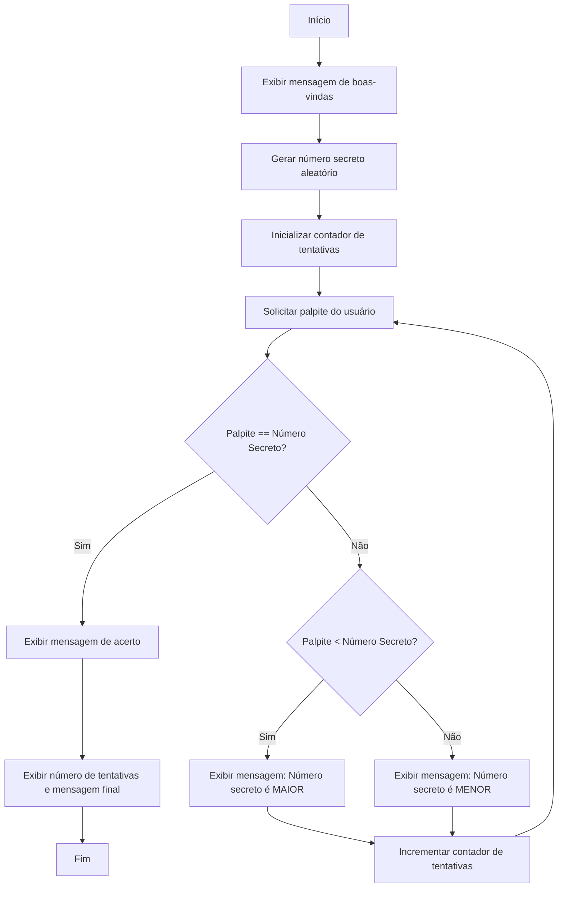

# Jogo do Número Secreto

Este é um jogo simples onde o jogador tenta adivinhar um número secreto gerado aleatoriamente. O jogo foi desenvolvido usando HTML, CSS e JavaScript.


<p align="center">
  <a href="#-tecnologias-utilizadas">🛠 Tecnologias Utilizadas</a>&nbsp;&nbsp;&nbsp;|&nbsp;&nbsp;&nbsp;
  <a href="https://juliacomg.github.io/JogoNumeroSecretoAlura/">👆🏻 Acesse Aqui</a>
</p>

## Como Jogar

1. **Iniciar o Jogo**: Ao abrir o jogo, você será solicitado a inserir um valor máximo para o número secreto.
2. **Adivinhar o Número**: O jogo gerará um número secreto aleatório entre 0 e o valor máximo que você escolheu. Você terá que adivinhar qual é esse número.
3. **Dicas**: Após cada tentativa, o jogo informará se o número secreto é maior ou menor do que o seu palpite.
4. **Vitória**: Quando você acertar o número secreto, o jogo exibirá uma mensagem de parabéns e informará quantas tentativas foram necessárias.

### Pré-requisitos

- Navegador web moderno (Google Chrome, Mozilla Firefox, Safari, etc.).
- Conexão com a internet (para carregar as bibliotecas externas).

## Como Executar o Projeto

1.[Acesse o site](https://juliacomg.github.io/JogoNumeroSecretoAlura/)
OU
Clone o repositório para o seu computador.
3. Abra o arquivo `index.html` no seu navegador.
4. Siga as instruções na tela para jogar.

## 🛠 Tecnologias Utilizadas

- **HTML5:** Estruturação da página web.
- **CSS3:** Estilização e design responsivo.
- **JavaScript:** Lógica de programação e interatividade.

## 📂 Estrutura do Projeto

- **index.html**: Contém a estrutura HTML da página do jogo.
- **style.css**: Contém os estilos CSS para a página do jogo.
- **app.js**: Contém a lógica do jogo em JavaScript.

```
/
├── 📂 img/ 
│   ├── 🖼️ Imagens
├── 📄 README.md
├── 📄 app.js
├── 📄 index.html
├── 🎨 style.css

```

## Diagrama de Fluxo do Projeto



## 🖥️ Contribuição

Contribuições são bem-vindas! Se você deseja contribuir para este projeto, siga os passos abaixo:

1. Faça um fork do repositório.
2. Crie uma branch para sua feature (`git checkout -b feature/nova-feature`).
3. Commit suas mudanças (`git commit -m 'Adicionando nova feature'`).
4. Push para a branch (`git push origin feature/nova-feature`).
5. Abra um Pull Request.

## 🛡️ Licença

Este projeto está sob a licença MIT. Isso significa que você pode utilizá-lo, modificá-lo e distribuí-lo livremente, desde que mantenha os créditos.

## 📧 Contato

Se você tiver alguma dúvida ou sugestão, sinta-se à vontade para entrar em contato:

- Giulia Armanelli
- GitHub: [JuliaComG](https://github.com/JuliaComG)
- Linkdin: https://www.linkedin.com/in/giulia-armanelli/
- Email: garmanelli.dev@gmail.com
